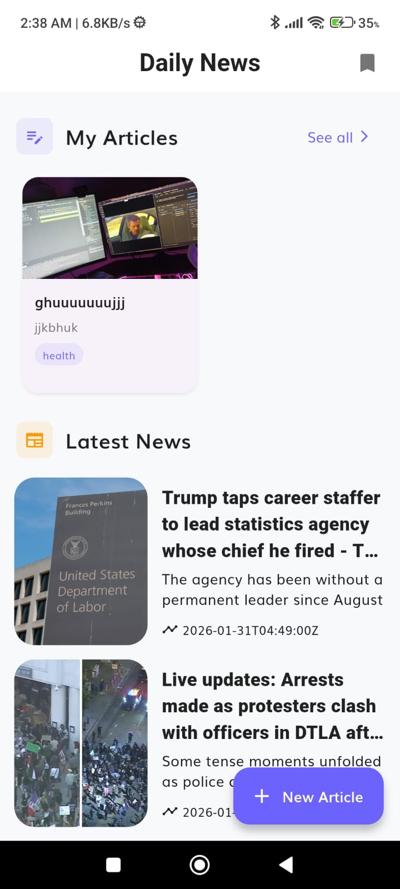
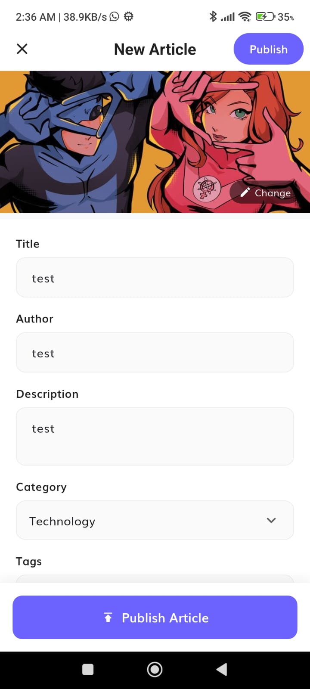
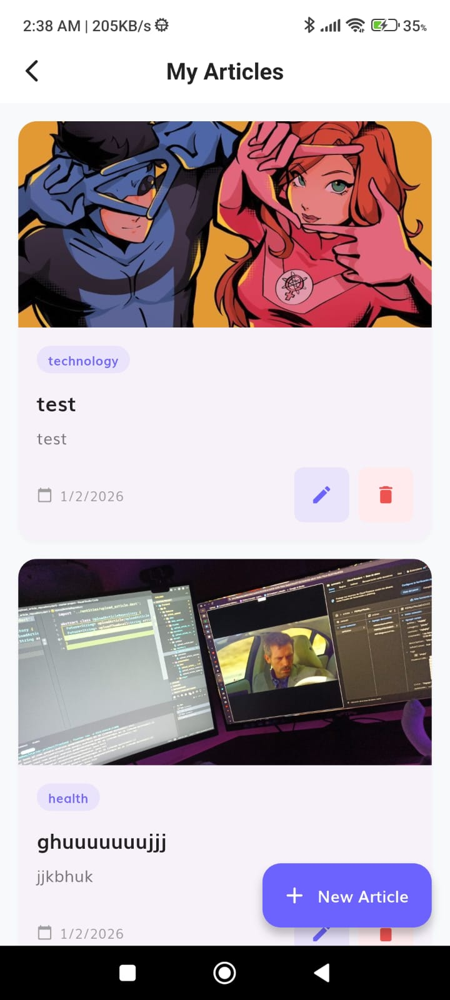
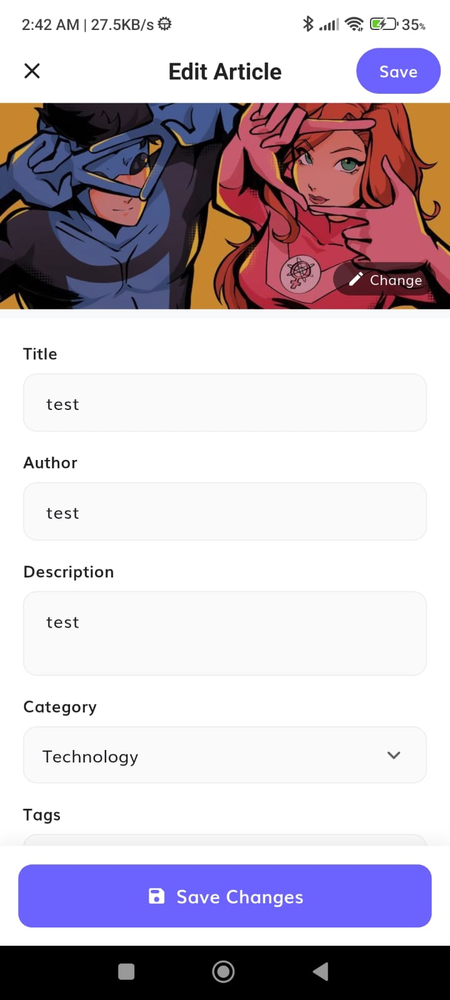
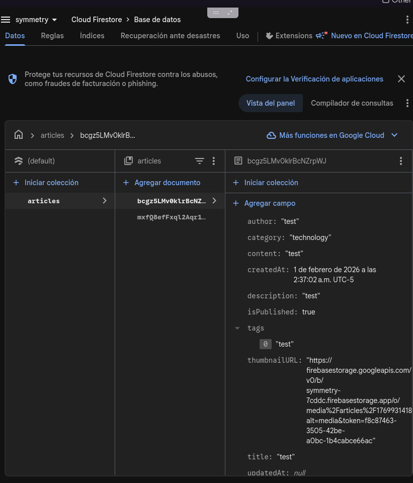
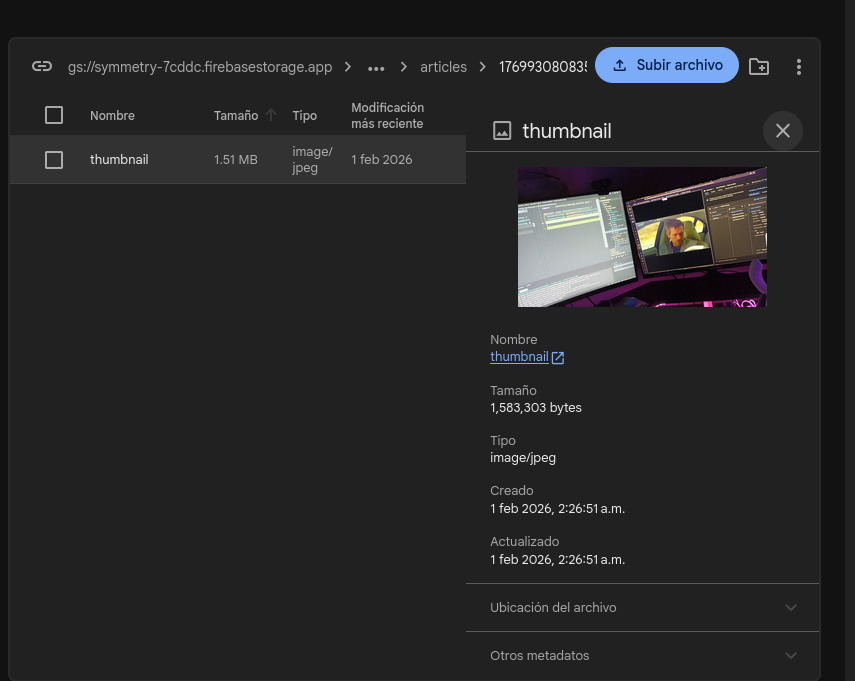

# Reporte - Applicant Showcase App

## 1. Introducción

Cuando vi este proyecto por primera vez, sentí una mezcla de emoción y nervios. Era un proyecto real con tecnologías que nunca había usado antes: Flutter, Firebase, y BLoC. Como desarrollador junior, sabía que sería un desafío significativo, pero también una oportunidad increíble para aprender.

Mi background antes de comenzar: Soy un desarrollador junior sin experiencia previa en desarrollo móvil. Este fue mi primer acercamiento real a Flutter y al ecosistema de Firebase.

## 2. Proceso de Aprendizaje

### Tecnologías que aprendí:

Todas las tecnologías fueron completamente nuevas para mí:

- **Flutter**: Framework de desarrollo móvil multiplataforma. Aprendí sobre widgets, estados, y cómo estructurar una aplicación móvil.

- **Firebase Firestore**: Base de datos NoSQL en la nube. Aprendí a crear colecciones, documentos, y cómo funcionan las reglas de seguridad.

- **Firebase Storage**: Servicio de almacenamiento de archivos. Aprendí a subir imágenes y obtener URLs de descarga.

- **Flutter BLoC**: Patrón de gestión de estado. Aprendí sobre eventos, estados, y cómo separar la lógica de negocio de la UI.

### Recursos que utilicé:

- Documentación oficial del proyecto (docs/ folder)
- Documentación oficial de Flutter y Firebase
- **Asistencia de IA**: Me apoyé en inteligencia artificial para guiarme en el proceso, pero siempre revisando y validando la información proporcionada. Esto me ayudó a entender conceptos más rápido y a resolver problemas que me hubieran tomado mucho más tiempo solo.

## 3. Desafíos Enfrentados

### Desafío 1: Dependencias Completamente Obsoletas

El proyecto tenía 2 años de antigüedad con dependencias severamente desactualizadas. Este fue el desafío más significativo:

| Tecnología            | Versión Original | Versión Actualizada |
| --------------------- | ---------------- | ------------------- |
| Flutter SDK           | 2.16             | 3.0.0+              |
| Gradle                | 7.x              | 8.11.1              |
| Kotlin                | 1.6              | 2.1.0               |
| Android Gradle Plugin | 7.x              | 8.9.1               |

**Solución**: Actualicé cada dependencia, resolviendo conflictos de compatibilidad uno por uno. Fue un proceso tedioso pero aprendí mucho sobre cómo funciona el sistema de dependencias en Flutter/Android.

### Desafío 2: Entorno de Android en Linux

Configurar el entorno de desarrollo de Android en Linux fue complicado. Tuve que:

- Configurar las variables de entorno correctamente
- Instalar las herramientas de SDK necesarias
- Resolver problemas de permisos con el dispositivo físico

**Solución**: Investigación y prueba y error. Aprendí que la paciencia es clave cuando se trabaja con entornos de desarrollo complejos.

### Desafío 3: Falta de Conocimiento Previo

No tenía ningún conocimiento previo de Flutter, Dart, Firebase ni desarrollo móvil en general. Todo era completamente nuevo.

**Solución**: Combiné la documentación oficial del proyecto con asistencia de IA, siempre verificando que la información fuera correcta y entendiendo el "por qué" detrás de cada decisión.

## 4. Reflexión y Direcciones Futuras

### Lo que aprendí:

**Lecciones Técnicas:**

- Cómo estructurar una aplicación móvil con Clean Architecture
- La importancia de separar la lógica de negocio de la interfaz
- Cómo funcionan las bases de datos NoSQL en la nube
- Gestión de estado con el patrón BLoC

**Lecciones Profesionales:**

- El desarrollo móvil puede ser complicado, pero también muy divertido
- La importancia de mantener las dependencias actualizadas
- Cómo usar IA como herramienta de aprendizaje sin depender ciegamente de ella
- La satisfacción de ver tu app funcionando en un dispositivo real

### Cómo me ayudó esta experiencia:

Esta experiencia me mostró que el desarrollo móvil es un campo que definitivamente quiero explorar más. Aunque fue desafiante, la sensación de ver la aplicación funcionando, subiendo artículos a Firebase y mostrándolos en pantalla, fue increíblemente gratificante.

En algún momento de mi carrera haré desarrollo móvil, y este proyecto me dio una base sólida y realista de lo que implica. Ahora sé qué tan complicado puede ser, pero también qué tan divertido es aprender tecnologías nuevas.

### Mejoras futuras que haría:

- [ ] Agregar autenticación (usuarios solo pueden editar sus propios artículos)
- [ ] Implementar modo oscuro
- [ ] Agregar animaciones y transiciones
- [ ] Soporte offline con caché local
- [ ] Editor de texto enriquecido para el contenido
- [ ] Filtrado por categorías
- [ ] Funcionalidad de búsqueda

## 5. Pruebas del Proyecto

### Capturas de Pantalla:

#### Pantalla Principal (Home)



#### Página de Subir Artículo



#### Mis Artículos



#### Editar Artículo



#### Artículos en Firestore



#### Imágenes en Firebase Storage



## 6. Overdelivery (Funcionalidades Extra)

Además de los requisitos básicos del proyecto, implementé las siguientes funcionalidades adicionales:

### 1. Subida de Imágenes con Firebase Storage

- Los usuarios pueden adjuntar imágenes de portada a sus artículos
- Las imágenes se almacenan en `media/articles/{articleId}/thumbnail`
- La URL se actualiza automáticamente en Firestore después de la subida
- Flujo optimizado: primero se sube la imagen, luego se crea el documento con la URL incluida

### 2. Página "Mis Artículos" (CRUD Completo)

- Vista de todos los artículos creados por el usuario
- Diseño con tarjetas atractivas mostrando imagen, título, categoría y fecha
- Estado vacío con diseño amigable

### 3. Funcionalidad de Edición

- Los usuarios pueden editar sus artículos existentes
- Formulario pre-llenado con la información actual
- Posibilidad de cambiar la imagen de portada
- Validación de campos obligatorios

### 4. Funcionalidad de Eliminación

- Diálogo de confirmación antes de eliminar
- Elimina tanto el documento de Firestore como la imagen de Storage
- Feedback visual con SnackBar de confirmación

### 5. Mejoras de UI/UX

- Diseño consistente con colores temáticos (púrpura #6C63FF)
- Validación de imagen obligatoria antes de publicar
- SnackBars informativos con iconos
- Estados de carga con mensajes descriptivos
- Botones flotantes con texto descriptivo
- Formularios con campos bien etiquetados y estilizados

### 6. Reglas de Seguridad de Firestore

- Validación de esquema en las reglas de seguridad
- Verificación de campos obligatorios (title, content, author, etc.)
- Reglas desplegadas y funcionando en producción

## 7. Arquitectura del Proyecto

### Estructura de la feature article_upload:

```
lib/features/article_upload/
├── data/
│   ├── data_sources/
│   │   └── firestore_article_service.dart    # Comunicación con Firebase
│   ├── models/
│   │   └── upload_article_model.dart         # Modelo con serialización
│   └── repository/
│       └── upload_article_repository_impl.dart
├── domain/
│   ├── entities/
│   │   └── upload_article.dart               # Entidad de dominio
│   ├── repository/
│   │   └── upload_article_repository.dart    # Contrato abstracto
│   └── usecases/
│       ├── upload_article_usecase.dart
│       ├── get_articles_usecase.dart
│       ├── update_article_usecase.dart
│       └── delete_article_usecase.dart
└── presentation/
    ├── bloc/
    │   ├── upload_article_bloc.dart
    │   ├── upload_article_event.dart
    │   ├── upload_article_state.dart
    │   └── my_articles/
    │       ├── my_articles_bloc.dart
    │       ├── my_articles_event.dart
    │       └── my_articles_state.dart
    └── pages/
        ├── upload_article_page.dart
        ├── edit_article_page.dart
        └── my_articles_page.dart
```

### Tecnologías Utilizadas:

| Tecnología         | Versión | Propósito                  |
| ------------------ | ------- | -------------------------- |
| Flutter            | 3.38.9  | Framework de desarrollo    |
| Dart               | 3.10    | Lenguaje de programación   |
| Firebase Firestore | 6.1.2   | Base de datos              |
| Firebase Storage   | 13.0.6  | Almacenamiento de imágenes |
| flutter_bloc       | 9.1.1   | Gestión de estado          |
| get_it             | 9.2.0   | Inyección de dependencias  |
| image_picker       | latest  | Selección de imágenes      |

### Esquema de Base de Datos:

**Colección: `articles`**

```json
{
  "title": "string (requerido)",
  "description": "string (requerido)",
  "content": "string (requerido)",
  "author": "string (requerido)",
  "thumbnailURL": "string (URL de imagen)",
  "category": "string",
  "tags": ["array", "de", "strings"],
  "isPublished": "boolean",
  "createdAt": "timestamp",
  "updatedAt": "timestamp"
}
```
